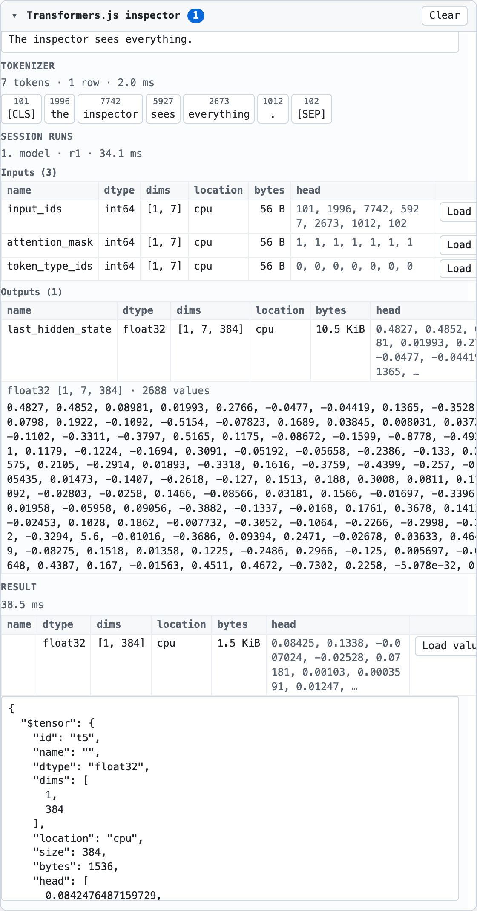
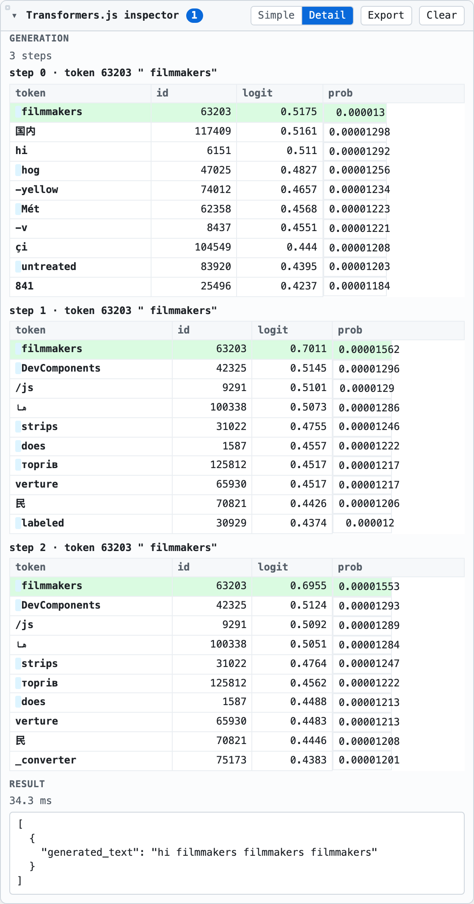
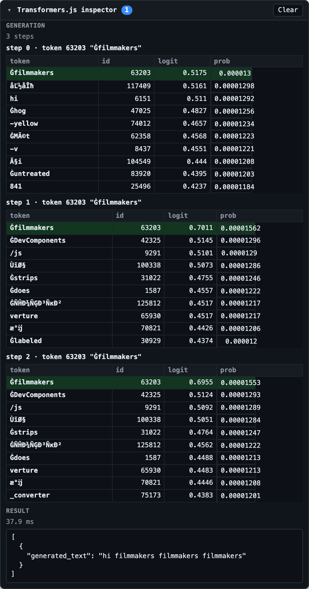

# transformersjs-inspector

A "Network tab" for local model calls. When a page runs a [Transformers.js](https://github.com/huggingface/transformers.js)
model in the browser, everything between the user's text and the model's answer is
invisible. `attach(pipe)` wraps the pipeline instance the page already holds and renders
every call as a row in a shadow-DOM panel: the raw input, the tokenizer's ids and token
strings, each named input and output tensor of every ONNX session run (dtype, shape, a
preview of the values, the full values on demand), per-step top-k logits for text
generation, and the pipeline's decoded result.

Zero runtime dependencies. Nothing on disk is patched; every hook is a runtime wrap of a
method on an instance Transformers.js exposes. Nothing leaves the tab.

**Status:** v0.1.0, verified against `@huggingface/transformers` 4.2.0 (Transformers.js
4.x only). Not yet published to npm; the CDN URLs below resolve once it is.

## 30-second usage

Wrap the pipeline right after `pipeline()` resolves. The panel mounts itself in the bottom
right corner of the page, collapsed to a badge that counts calls.

npm / ESM:

```bash
npm install transformersjs-inspector
```

```ts
import { pipeline } from '@huggingface/transformers';
import { attach } from 'transformersjs-inspector';

const pipe = await pipeline('feature-extraction', 'Xenova/all-MiniLM-L6-v2');
const handle = attach(pipe);

await pipe('The inspector sees everything.', { pooling: 'mean', normalize: true });
// Open the panel: one row, expand it for tokens, tensors and the result.

handle.detach(); // restores every wrapped method; idempotent
```

Script tag, with Transformers.js from a CDN:

```html
<script type="module">
  import { pipeline } from 'https://cdn.jsdelivr.net/npm/@huggingface/transformers@4.2.0';
  import { attach } from 'https://cdn.jsdelivr.net/npm/transformersjs-inspector@0.1.0/dist/index.js';

  const pipe = await pipeline('text-generation', 'onnx-community/tiny-random-LlamaForCausalLM-ONNX');
  attach(pipe);
  await pipe('hi', { max_new_tokens: 3 });
</script>
```

`attach()` throws `InspectorError` if the argument is not a Transformers.js pipeline (it
duck-types `pipe.model.sessions`). It works on any pipeline whose model runs through
`model.sessions[name].run`, i.e. every ONNX-backed pipeline in 4.x; the tokenizer and
generation wrappers are added when `pipe.tokenizer` and `model.generate` exist.

## What the panel shows

Feature extraction (`Xenova/all-MiniLM-L6-v2`): the tokenizer chips, the session run with
its three `int64 [1, 7]` inputs and the `float32 [1, 7, 384]` output, and the values of
`last_hidden_state` after clicking **Load values**.



Text generation (`onnx-community/tiny-random-LlamaForCausalLM-ONNX`, `max_new_tokens: 3`):
one block per generated token with the top-k table the sampler saw, the picked row
highlighted, and the pipeline's decoded result. (The model is randomly initialised, hence the
flat distribution and the repeated token.)



Dark theme: the panel follows `prefers-color-scheme` by default (`theme: 'auto'`); `theme:
'dark'` or `'light'` forces one whatever the OS prefers. The demo takes `?theme=dark`.



How it is organised:

- **One row per pipeline call**: sequence number, label (`task · model_type` by default),
  an excerpt of the input, wall time, status dot. Click to expand. The header badge counts
  calls; while the panel is collapsed only the badge updates.
- **Input**: text (truncated to 2000 chars) or texts; an image shows a thumbnail and its
  size and channels, audio shows a waveform with its sample count, rate and duration (see
  "Media previews" below).
- **Tokenizer**: every `tokenizer(text)` call during the row, as `id / token` chips (decoded
  text, with leading or trailing whitespace tinted; the vocab string on hover).
- **Session runs**: one block per `session.run` (a decoder-only model produces one per
  generated token), each with an Inputs and an Outputs table: `name`, `dtype`, `dims`,
  `location` (`cpu`, `gpu-buffer`, ...), `bytes`, and `head`, the first 8 values. Values
  are read eagerly only for CPU-resident tensors and only those 8.
- **Load values**: fetches the full tensor by id through the bus from a byte-budgeted
  store (64 MiB, LRU) and renders up to 4096 values. A GPU-resident tensor is copied back
  only when you click; a tensor evicted from the store reports `evicted`.
- **Preview**: on tensor rows whose dims look like an image, fetches the same values and
  draws them as one (see "Media previews").
- **Generation**: per step, the token id and string that was picked and a top-k table
  (`token`, `id`, `logit`, `prob`, 10 rows by default) taken from a logits processor, so it
  reflects what the sampler saw after repetition penalties and the like. Raw logits are still
  on the session run row.
- **Result**: the pipeline's return value as JSON, with tensors replaced by `$tensor`
  markers and listed in a table above it.

Rows that arrive without a pipeline call (the preload path, or a direct `model.sessions`
call) are shown as `direct · <session>` rows with only the session run.

### Media previews

At the input boundary the `call:start` event carries a small, clone-safe preview, and the
panel draws it:

- **Audio** (`Float32Array`, `Float64Array`, or a `{ audio, sampling_rate }` RawAudio): the
  sample count, rate and duration, and an inline SVG waveform built from 200 min/max
  buckets computed at capture time (at most 400 numbers, so a minute of 16 kHz audio costs
  about 3 KB in the event). Chunked audio (`Float32Array[]`) shows a sample count only.
- **Image** (a `RawImage`, or anything with `width`, `height`, `channels`, `data`): the size
  and channel count, and a JPEG thumbnail at most 96 px on the long side (a few KB). The
  panel only ever sets an `` to a `data:image/` URL: a `Blob`, `URL` or http input
  is listed by its URL as text and never fetched.

**Preview** appears on tensor rows whose `dtype` and `dims` can be read as pixels or as a
2-D map: `[1, 3, H, W]` and `[3, H, W]` (RGB, channels first), `[1, H, W, 3]` and `[H, W, 3]`
(RGB, channels last), and `[H, W]`, `[1, H, W]`, `[1, 1, H, W]` or `[1, C, T]` as a grayscale
map (Whisper's `input_features [1, 80, 3000]`, or an encoder's `[1, tokens, hidden]` state).
Both sides must be at least 8; `float16` and `string` tensors are skipped. Clicking fetches
the tensor through the bus exactly like **Load values** (so it works across the worker
bridge), normalises each channel from its own min/max (one global range for grayscale),
downsamples any side over 512 px by nearest-neighbour sampling, and paints a `<canvas>` with
the min/max mapping written under it. The two buttons share the row's cell; the last click
wins.

Thumbnails need a `<canvas>` to encode, which a Web Worker does not have, so when `attach()`
runs in a worker the image preview is metadata only (the waveform is plain arithmetic and
works everywhere). The tensor **Preview** is unaffected: the bytes come back over the bridge
and are painted on the page.

### Where the panel sits

The panel is fixed to a corner of whatever it is mounted in (`document.body` by default, or
`PanelOptions.container`): the bottom-right one unless `PanelOptions.dock` names another
(`'bottom-left'`, `'top-right'`, `'top-left'`; the demo takes `?dock=top-left`). It measures
itself and stays inside the visible viewport: if the host parks it above a dock or inside a
transformed element, it shrinks to the space on the far side of that anchor rather than running
off the screen, and on mobile it uses the visual viewport so the header stays reachable to
collapse it again. Only when the anchor itself is off screen is the panel nudged back inside.

Drag the 16px grip on the corner opposite the anchor (top-left of a bottom-right panel) to
resize it; the size is clamped to the viewport and to a 280x160 minimum, and a double-click on
the grip restores the default width and content height. The size lives for the panel's lifetime
only: nothing is persisted, and a new `mountPanel` starts at the default again.

## Zero-touch preload

`attach(pipe)` is the headline API and always works. The secondary entry, `preload`, needs no
change to the host's pipeline code at all: it installs a shim of onnxruntime-web on
`globalThis[Symbol.for('onnxruntime')]`, the hook Transformers.js 4.x checks when it
evaluates, whose `InferenceSession.create` wraps every session's `run`. Load it as a module
script **before** the script that loads Transformers.js:

```html
<script type="module" src="https://cdn.jsdelivr.net/npm/transformersjs-inspector@0.1.0/dist/preload.js"></script>
<script type="module">
  import { pipeline } from 'https://cdn.jsdelivr.net/npm/@huggingface/transformers@4.2.0';
  const pipe = await pipeline('feature-extraction', 'Xenova/all-MiniLM-L6-v2', { device: 'auto' });
  await pipe('The inspector sees everything.');
  // The panel (bottom right) shows one row per session run, labelled `direct · session#1 → last_hidden_state`.
</script>
```

Module scripts execute in document order, so the shim is in place before Transformers.js
picks its runtime. From a bundler, `import 'transformersjs-inspector/preload'` must land in a
chunk that evaluates before the one importing Transformers.js; the package marks
`dist/preload.js` as having side effects so it is not tree-shaken. See `demo/preload.html`
and `e2e/preload.spec.ts` for the page that proves it.

Three caveats, all from `docs/01-research.md`:

- **`device: 'auto'` is required.** With the symbol set, Transformers.js takes its
  "custom runtime" branch, whose supported-device list is empty, so the default `'wasm'`
  throws `Unsupported device: "wasm". Should be one of: .` before any session is created;
  `'auto'` returns the (empty) list as-is and ORT then picks its own default. The upstream
  fix is a few lines in `src/backends/onnx.js` — populate `supportedDevices` from the injected
  module's `env`, or treat an injected web runtime like the web branch — and would make the
  preload unconditional; it should be filed against transformers.js.
- **ORT version coupling.** The preload does not bundle onnxruntime-web; `dist/preload.js`
  statically imports `https://cdn.jsdelivr.net/npm/onnxruntime-web@<version>/dist/ort.webgpu.bundle.min.mjs`,
  where `<version>` is derived at build time from the `onnxruntime-web` dependency of the
  installed `@huggingface/transformers` (`1.26.0-dev.20260416-b7804b056c` for 4.2.0). Use the
  preload only with that Transformers.js minor; a mismatch means session options may not line
  up. It is a second ~2 MB download (JS + WASM) that `attach()` never needs.
- **Only the session boundary is visible.** The preload has no pipeline reference, so rows
  carry no input text, tokenizer ids, per-step logits or decoded result; those need `attach()`.
  Both share one bus and one panel, so a page may use both.

## Web Workers

Many pages run the pipeline in a worker. `attach()` then lives in the worker and the panel on
the page, joined by the same `InspectorBus` over `postMessage`. **Load values** still works:
the page bus forwards the tensor request to the worker's store and the typed array comes back
through structured clone.

Worker:

```ts
import { pipeline } from '@huggingface/transformers';
import { InspectorBus, attach } from 'transformersjs-inspector';
import { exposeToPage } from 'transformersjs-inspector/worker';

const bus = new InspectorBus();
exposeToPage(bus); // relays over `self`

const pipe = await pipeline('feature-extraction', 'Xenova/all-MiniLM-L6-v2');
attach(pipe, { bus, panel: false });
```

Page:

```ts
import { mountPanel } from 'transformersjs-inspector';
import { connectWorker } from 'transformersjs-inspector/worker';

const worker = new Worker(new URL('./inference.worker.ts', import.meta.url), { type: 'module' });
mountPanel(connectWorker(worker), { open: true });
```

Every inspector message on the port carries `__tjsi: 1`; the transport ignores anything
else, and the host's own message handler should ignore anything that has it. `connectWorker`,
`exposeToPage` and the underlying `messagePortTransport(port)` (any `Worker`, `MessagePort`
or `self`) are also exported from the main entry; `demo/worker.html` and `e2e/worker.spec.ts`
show the full wiring.

## Options

`attach(pipe, opts?)` takes `AttachOptions`, which is `Partial<InspectorOptions>` plus:

| Option | Type | Default | Meaning |
|---|---|---|---|
| `bus` | `InspectorBus` | process-wide default bus | Bus the wrappers emit on. |
| `store` | `TensorStore` | process-wide default store | Store that hands out tensor ids and answers **Load values**. |
| `panel` | `boolean \| PanelOptions` | mount | `false` mounts no panel; an object is passed to `mountPanel`. A no-op where there is no DOM (workers). |

`InspectorOptions` (`src/context.ts`):

| Option | Type | Default | Meaning |
|---|---|---|---|
| `head` | `number` | `8` | Values summarised eagerly per tensor. |
| `topK` | `number` | `10` | Entries per `logits` event (rows in each top-k table). |
| `retainBytes` | `number` | `64 * 1024 * 1024` | Nominal byte budget of the tensor store (LRU beyond it). |
| `retainLogits` | `boolean` | `false` | Keep every step's full logits tensor in the store (512 KB per step on a 128k vocab). |
| `label` | `string` | `` `${task} · ${model_type}` `` | Row label for `call:start`. |
| `transformers` | `{ LogitsProcessorList }` | unset | Escape hatch: if the host's Transformers.js rejects a plain array as `logits_processor`, pass its class and a real list is built. Not needed on 4.2.0. |

`PanelOptions` (`mountPanel(bus, opts?)` and `attach(pipe, { panel: opts })`):

| Option | Type | Default | Meaning |
|---|---|---|---|
| `container` | `Element` | `document.body` | Where the host `<div data-tjsi-panel>` is appended. |
| `open` | `boolean` | `false` | Start expanded rather than as a badge. |
| `title` | `string` | `Transformers.js inspector` | Header text. |
| `maxCalls` | `number` | `200` | Rows kept; the oldest are dropped beyond this. |
| `theme` | `'auto' \| 'light' \| 'dark'` | `'auto'` | `auto` follows `prefers-color-scheme`; the others force a theme. Written to `data-theme` on the host `<div>`. |
| `dock` | `'bottom-right' \| 'bottom-left' \| 'top-right' \| 'top-left'` | `'bottom-right'` | The viewport corner the panel is fixed to; it grows away from it and the resize grip sits on the opposite corner. Written to `data-dock` on the host `<div>`. |

The `AttachHandle` returned by `attach()` carries `bus`, `store` and `detach()`.

## Events

Everything the panel shows is a JSON-safe event on an `InspectorBus` (`bus.on(listener)`
for every event as it happens, `bus.history` for the recent ones), so the same stream can
feed your own UI or a test. Every event survives
`structuredClone` and `JSON.stringify`: no bigint, typed arrays or DOM nodes.

| Event | Carries |
|---|---|
| `call:start` | `callId`, `label`, `task`, `input` preview |
| `tokenize` | `text`, `ids[][]`, `tokens[][]` (decoded text), `raw[][]` (vocab strings), `ms` |
| `run:start` | `runId`, `session`, `inputs: TensorSummary[]` |
| `run:end` | `runId`, `session`, `outputs: TensorSummary[]`, `ms`, `error` |
| `logits` | `step`, `vocab`, `topK: { id, token, logit, prob, raw }[]`, `tensorId` |
| `token` | `step`, `ids`, `text` (decoded), `raw` (vocab strings joined) |
| `result` | `callId`, `result` (tensors as `$tensor` markers), `ms`, `error` |

Token strings come in two forms. `tokens`, `token` and `text` are the tokenizer-decoded
text of each id (`decode([id], { skip_special_tokens: false, clean_up_tokenization_spaces: false })`),
which is what the panel shows; `raw` is the vocab string (`id_to_token`), shown on hover.
`raw` is optional and new in 0.2.0: events without it (an older capture) still render.
Caveat: decoding one id at a time means a Metaspace (`▁word`) or WordPiece (`##ing`) token
loses its leading-space or continuation marker in the decoded form (`word`, `ing`); `raw`
keeps it. A tokenizer without `decode` reports the vocab string in both fields.

A `TensorSummary` is `{ id, name, dtype, dims, location, size, bytes, head }`; the full
values are fetched with `bus.request('tensor', { id })`, whose response (`TensorData`) is the
one place a typed array may appear. The full definitions and the `isInspectorEvent` guard are
in [`src/events.ts`](src/events.ts).

## What you cannot see

By design (`docs/00-brief.md`):

- **No per-layer activations.** ONNX Runtime returns only the declared graph outputs; the
  panel shows exactly the named inputs and outputs of each `session.run`. Seeing inside a
  model means rewriting the ONNX graph, which this does not do.
- **Transformers.js 4.x only.** Not TensorFlow.js, WebLLM, MediaPipe or pages that call
  onnxruntime-web directly. The tokenizer and pipeline hooks use underscore-private methods
  (`tokenizer._call`, `pipe._call`) that are stable in practice but not documented API.
- **Read-only.** No editing or replaying of inputs.
- **Nothing persisted or uploaded.** No `localStorage`, no downloads, no network requests;
  everything lives in the tab and is gone on reload.

Known limitations of this version (`docs/02-plan.md`, "Out of scope"):

- **Concurrent calls on one pipeline** may attribute session runs to the wrong row: a
  single "current call" is tracked per pipeline, so interleaved `await pipe(...)` calls are
  not disambiguated.
- **Processors are not wrapped.** `pipe.processor` (image and audio feature extractors) is
  not hooked; an image or audio input is previewed as it enters the pipeline (thumbnail or
  waveform plus metadata) and its preprocessed tensors appear at the session boundary, where
  **Preview** can draw them. Image thumbnails are not produced inside a Web Worker.
- **KV cache is listed as plain tensors.** `present.*` / `past_key_values.*` are ordinary
  rows in the tensor tables, not a growing cache view; on WebGPU they are `gpu-buffer` and
  are copied back only on **Load values**.
- Encoder-decoder models (Whisper, T5) are covered at the session boundary by construction
  (`encoder_model` + `decoder_model_merged`) but are not in the demo.
- Expanding a row re-renders it when the call updates, which drops values already loaded
  into it; click **Load values** again.

## Overhead

The demo's **Benchmark** button times 30 `Xenova/all-MiniLM-L6-v2` embeddings with the
pipeline detached and 30 more with it attached and the panel closed (5 warm-up runs first),
and reports both medians. On this machine, headless Chromium, wasm backend
(`e2e/overhead.spec.ts`):

| run | detached median | attached median | ratio |
|---|---|---|---|
| cold | 6.80 ms | 6.50 ms | 0.956 |
| warm | 6.80 ms | 6.70 ms | 0.985 |
| warm | 6.60 ms | 6.50 ms | 0.985 |

The attach overhead is below the run-to-run noise (about ±5 % on 6–7 ms runs), which is
what you would expect: the hot path summarises 8 values per CPU tensor and computes top-k
over the logits, and reads nothing else until you click. The e2e asserts the noise-tolerant
`ratio < 1.25`; a 5 % gate on runs this short would flake. Generation adds one top-k pass
per step (a `[1, 1, vocab]` scan), which is not separately benchmarked.

## Development

```bash
npm install
npx playwright install chromium   # once; the e2e suite drives headless Chromium

npm run dev          # Vite demo on http://localhost:5173 (Transformers.js from the jsDelivr CDN)
npm run typecheck    # tsc --noEmit
npm test             # Vitest, offline (test/**/*.test.ts)
npm run lint         # ESLint
npm run build        # dist/index.js, dist/preload.js, dist/worker.js + .d.ts
npm run build:demo   # dist-demo/ (index, preload and worker pages)
npm run e2e          # Playwright against the demo; e.g. npm run e2e -- e2e/demo.spec.ts
npm run screenshots  # rewrites docs/img/panel-*.png from the demo (not part of `npm run e2e`)
```

`npm run e2e` starts the demo server itself (or reuses one on :5173). The Chromium profile
under `.cache/pw-profile` persists between runs, so the two fixture models
(`Xenova/all-MiniLM-L6-v2`, the encoder, and `onnx-community/tiny-random-LlamaForCausalLM-ONNX`,
a 41 MB randomly initialised decoder) and the CDN module are downloaded once and served from
the browser cache afterwards; delete that directory to force a fresh download. The demo also
has a text-classification section (`Xenova/distilbert-base-uncased-finetuned-sst-2-english`)
that the e2e does not exercise.

Package layout: `.` (`attach`, `InspectorBus`, `TensorStore`, `mountPanel`, the worker
helpers, all types), `./preload` (side-effect entry) and `./worker` (`connectWorker`,
`exposeToPage`, `messagePortTransport`). `@huggingface/transformers` is an optional peer
(`>=4 <5`) used for types only; the library never imports it at runtime.

## License

MIT, see [LICENSE](LICENSE).
