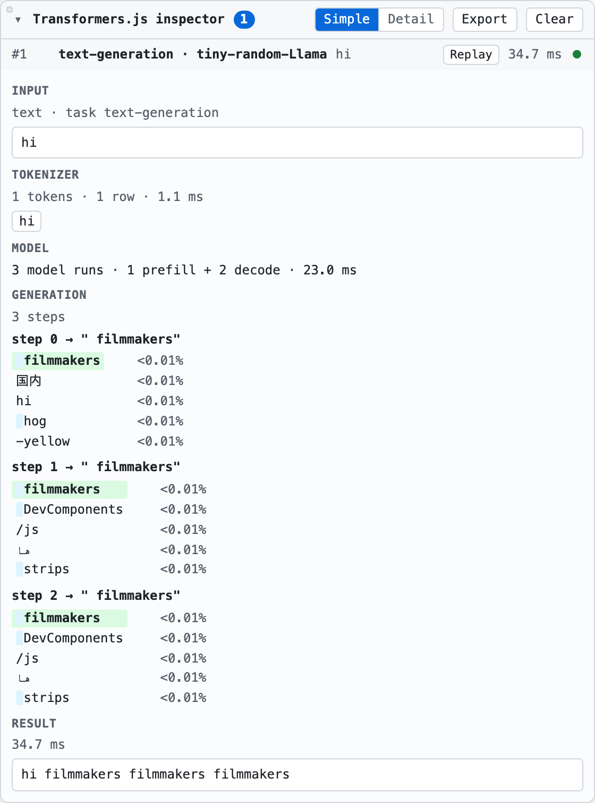

# transformersjs-inspector

A browser panel for inspecting [Transformers.js](https://github.com/huggingface/transformers.js)
model calls. Attach it to a pipeline to see inputs, tokens, inference runs, tensors, and results.

Zero runtime dependencies. Inspection stays in the browser; you can export a capture yourself.

**Status:** v0.3.0. Targets Transformers.js 4.x; tested with 4.2.0. Not yet published to npm.



## Quick start

Build the package locally:

```bash
git clone https://github.com/pratikamin/transformersjs-inspector.git
cd transformersjs-inspector
npm ci
npm run build
```

Then install it in your app:

```bash
npm install /path/to/transformersjs-inspector
```

Attach it after creating a pipeline:

```ts
import { pipeline } from '@huggingface/transformers';
import { attach } from 'transformersjs-inspector';

const pipe = await pipeline('feature-extraction', 'Xenova/all-MiniLM-L6-v2');
const inspector = attach(pipe);

await pipe('A sentence to inspect.', { pooling: 'mean', normalize: true });
```

Open the badge in the bottom-right corner to inspect the call. Use
`inspector.detach()` when you're finished to restore the pipeline's original methods.

## What you can inspect

- **Simple view:** input, decoded tokens, model timing, generated tokens and alternatives, result.
- **Detail view:** token IDs, named session inputs and outputs, tensor shapes, data types, and values.
- **Media:** audio waveforms, image thumbnails, and previews of compatible tensors.
- **Replay:** run a captured call again with the same arguments.
- **Export:** save the event history as JSON. Full tensor values aren't included.

GPU tensor values are fetched only when you select **Load values** or **Preview**.
The panel supports light/dark themes, resizing, and placement in any corner.

## Configuration

```ts
const inspector = attach(pipe, {
  label: 'Search embeddings',
  panel: { view: 'detail', theme: 'auto', dock: 'bottom-right' },
  retainBytes: 16 * 1024 * 1024,
  replayHistory: 0,
});
```

`retainBytes` gives this attachment its own tensor budget; `0` retains no tensors.
Without it, attachments share a default 64 MiB store. An explicit `store` takes precedence.
Replay keeps argument references separately; its default is 200 calls per bus.

See the [usage guide](docs/usage.md) for Web Workers, shared stores, events, export,
replay, and the preload entry. Full types: [attachment options](src/attach.ts),
[inspection options](src/context.ts), [panel options](src/panel/panel.ts),
and [events](src/events.ts).

## Limits

- Shows ONNX session inputs and outputs, not internal layer activations.
- Overlapping calls on the **same pipeline** can attribute runs to the wrong row.
- Uses private Transformers.js hooks; compatibility can change between versions.
- Retention budgets cover tensors, not total browser memory. Replay uses the original
  argument references, so later mutations affect what gets replayed.
- Instrumentation adds work. Benchmark with your own model and device.

## Development

Use Node 22.12 or later for development (Node 20 or later to consume the package).

```bash
npm run dev          # demo at localhost:5173
npm test             # offline unit tests
npm run typecheck
npm run lint
npm run build
npx playwright install chromium
npm run e2e          # browser tests; downloads fixture models on first use
```

## License

[MIT](LICENSE).
